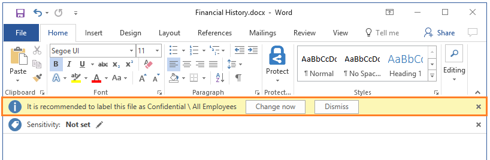

# Konfigurowanie warunków klasyfikacji automatycznej i zalecanej dla usługi Azure Information Protection

>*Dotyczy: [usługi Azure Information Protection](https://azure.microsoft.com/pricing/details/information-protection)*

W przypadku skonfigurowania warunków dla etykiety możesz automatycznie przypisywać etykietę do dokumentu lub wiadomości e-mail. Możesz też monitować użytkowników o wybranie zalecanej etykiety. 

Po skonfigurowaniu tych warunków, można użyć wstępnie zdefiniowanych wzorców, takich jak **numer karty kredytowej** lub **numer ubezpieczenia społecznego USA (SSN)**. Możesz zdefiniować niestandardowy ciąg lub szablon będący warunkiem automatycznej klasyfikacji. Te warunki dotyczą tekstu podstawowego w dokumentach i wiadomościach e-mail oraz nagłówków i stopek. Aby uzyskać więcej informacji o warunkach, zobacz krok 5 w [procedury](#to-configure-recommended-or-automatic-classification-for-a-label).

Aby zapewnić najlepszą jakość obsługi i ciągłość prowadzenia działalności biznesowej, warto rozpocząć od użycia zalecanej klasyfikacji dla użytkownika, a nie od klasyfikacji automatycznej. Ta konfiguracja pozwala użytkownikom Zaakceptuj klasyfikacji i wszystkie skojarzone ochrony lub ochronnych, jeśli nie są one odpowiednie dla ich dokumentu lub wiadomości e-mail.

Przykład monitu w przypadku konfigurowania warunki do zastosowania etykiety jako akcji zalecanej, ze wskazówką dotyczącą zasad niestandardowych:

W tym przykładzie użytkownik może kliknąć **teraz zmienić** zastosować zalecaną etykietę, lub zignorować zalecenie przez wybranie **Odrzuć**. Jeśli warunek ma nadal zastosowanie, gdy dokument zostanie otwarty następnym razem użytkownik wybierze opcję Odrzuć zalecenia, zalecenie etykiety jest wyświetlany ponownie. 

> [!IMPORTANT]
>Nie należy konfigurować etykiety klasyfikacji automatycznej i uprawnienia użytkownika. Opcja uprawnienia zdefiniowane przez użytkownika jest [ustawienie ochrony](configure-policy-protection.md) który umożliwia użytkownikom określanie, kto powinien mieć przyznane uprawnienia.
>
>Po skonfigurowaniu etykiety klasyfikacji automatycznej i uprawnienia zdefiniowane przez użytkownika zawartość jest sprawdzane dla warunków i ustawienie uprawnienia zdefiniowane przez użytkownika nie ma zastosowania. Można użyć zalecaną klasyfikację i uprawnienia zdefiniowane przez użytkownika.

## W jaki sposób automatycznej lub zalecanej etykiety są stosowane

- Automatyczna klasyfikacja ma zastosowanie do programu Word, Excel i PowerPoint, gdy dokumenty są zapisywane, a zastosowanie do programu Outlook przy wysyłaniu wiadomości e-mail. 
    
    Nie można użyć automatycznej klasyfikacji dokumentów i wiadomości e-mail, które zostały wcześniej oznaczone ręcznie lub wcześniej automatycznie z etykietą wyższej klasyfikacji. 

- Zalecana klasyfikacja ma zastosowanie do programu Word, Excel i PowerPoint, gdy dokumenty są zapisywane. Nie można użyć zalecana klasyfikacja dla programu Outlook, o ile nie skonfigurowano [Zaawansowane ustawienia klienta](./rms-client/client-admin-guide-customizations.md#enable-recommended-classification-in-outlook) , jest obecnie dostępna w wersji zapoznawczej.
    
    Nie można używać zalecana klasyfikacja dokumentów, które wcześniej zostały oznaczone za pomocą wyższej klasyfikacji. 

Aby zmienić to zachowanie, tak aby klient usługi Azure Information Protection okresowo sprawdza, czy dokumenty dla reguł warunku, które określisz. Ta konfiguracja wymaga [Zaawansowane ustawienia klienta](./rms-client/client-admin-guide-customizations.md#turn-on-classification-to-run-continuously-in-the-background) , jest obecnie dostępna w wersji zapoznawczej.

### Jak wiele warunków są oceniane, jeśli są zastosowane wobec więcej niż jednej etykiety

1. Etykiety są uporządkowane do oceny zgodnie z ich pozycją określoną w zasadach: etykieta na pierwszej pozycji ma najniższą pozycję (najmniejszą ważność), a ostatnia najwyższą (największa ważność).

2. Zostaje zastosowana etykieta wskazująca najwyższą ważność.
 
3. Ostatnie etykiety podrzędnej jest stosowany.

## Aby skonfigurować zalecaną lub automatyczną klasyfikację dla etykiety

1. Jeśli jeszcze tego nie zrobiono, Otwórz nowe okno przeglądarki i [Zaloguj się do witryny Azure portal](configure-policy.md#signing-in-to-the-azure-portal). Następnie przejdź do bloku **Azure Information Protection**. 
    
    Na przykład w menu Centrum kliknij pozycję **wszystkich usług** i zacznij wpisywać **informacji** w polu filtru. Wybierz pozycję **Azure Information Protection**.

2. Z **klasyfikacje** > **etykiety** opcji menu: na **usługi Azure Information Protection — etykiety** bloku, wybierz etykietę do skonfigurowania.

3. W bloku **Etykieta** w sekcji **Konfigurowanie warunków dla automatycznego stosowania tej etykiety** kliknij przycisk **Dodaj nowy warunek**.

4. Na **warunek** bloku wybierz **typów informacji** Jeśli chcesz użyć wstępnie zdefiniowanego warunku lub **niestandardowe** Jeśli chcesz określić własne:
    - Aby uzyskać **typów informacji**: Wybierz z listy dostępnych warunków, a następnie wybierz minimalną liczbę wystąpień i tego, czy wystąpienie powinno mieć unikatową wartość, która mają zostać uwzględnione w liczbie wystąpień.
        
        Typy informacji za pomocą typów informacji czułości prevention (DLP) utraty danych usługi Office 365 i wykrywania wzorca. Możesz wybrać wiele popularnych typów informacji poufnych, niektóre z nich są specyficzne dla różnych regionów. Aby uzyskać więcej informacji, zobacz [jakie dostępne typy informacji poufnych](https://support.office.com/article/What-the-sensitive-information-types-look-for-fd505979-76be-4d9f-b459-abef3fc9e86b) w dokumentacji pakietu Office.
        
        Lista typów informacji, które można wybierać w witrynie Azure portal jest okresowo aktualizowany obejmujący wszystkie nowe informacje będą publikowane DLP usługi Office. Jednak lista nie obejmuje żadnych niestandardowych typów informacji poufnych, które zostały zdefiniowane i przekazane jako pakiet reguły do Centrum zgodności i zabezpieczeń usługi Office 365.
        
        > [!IMPORTANT]
        > Niektóre typy informacji wymagają minimalną wersję klienta. [Więcej informacji](#sensitive-information-types-that-require-a-minimum-version-of-the-client) 
        
        Gdy usługi Azure Information Protection ocenia typy informacji, które można wybrać, jest używane ustawienie poziomie zaufania DLP usługi Office, ale zgodna z najniższą zaufania.
    
    - W przypadku opcji **Niestandardowy**: określ nazwę i frazę do dopasowania, bez znaków cudzysłowu i znaków specjalnych. Następnie określ, czy dopasowywać jako wyrażenie regularne, uwzględniać wielkość liter, a minimalna liczba wystąpień i tego, czy wystąpienie powinno mieć unikatową wartość do uwzględnienia w wystąpieniu liczba.
        
        Wyrażenia regularne używać wzorców wyrażeń regularnych usługi Office 365. Aby uzyskać więcej informacji, zobacz [Definiowanie wyrażenia regularnego na podstawie dopasowań](https://technet.microsoft.com/library/jj674702(v=exchg.150).aspx#Anchor_2) w dokumentacji pakietu Office. Ponadto, użytkownik może być bardzo przydatne do odwołania [składni wyrażeń regularnych w Perl](http://www.boost.org/doc/libs/1_66_0/libs/regex/doc/html/boost_regex/syntax/perl_syntax.html) z Boost.
        
5. Zdecyduj, czy musisz zmienić **minimalna liczba wystąpień** i **liczba zdarzeń o tylko unikatowe wartości**, a następnie wybierz pozycję **Zapisz**. 
    
    Przykład opcji wystąpień: Wybierz typ informacji, aby uzyskać numer ubezpieczenia społecznego, Ustaw minimalną liczbę wystąpień jako 2 i dokument ma ten sam numer ubezpieczenia społecznego jest wymieniona dwukrotnie: Jeśli ustawisz **liczba wystąpień tylko unikatowe wartości** do **na**, nie jest spełniony warunek. Jeśli ta opcja jest ustawiona na **poza**, warunek jest spełniony.

6. Po powrocie **etykiety** bloku, skonfiguruj następujące opcje, a następnie kliknij przycisk **Zapisz**:
    
    - Wybierz automatyczną lub zalecaną klasyfikację: dla opcji **Wybierz sposób stosowania etykiety: automatycznie lub jako zalecenie dla użytkownika** wybierz wartość **Automatycznie** lub **Zalecenie**.
    
    - Określ tekst monitu dla użytkownika lub wskazówki dotyczącej zasad: zachowaj tekst domyślny lub podaj własny ciąg.

Po kliknięciu **Zapisz**, zmiany są automatycznie dostępne dla użytkowników i usług. Nie ma już opcji publikowania oddzielne.

### Typy informacji poufnych, które wymagają minimalną wersję klienta

> [!NOTE]
> Następujące typy informacji czułości są teraz zetknie się dzierżaw, ale mogą jeszcze być niewidoczne do wyboru. Jednak w przypadku skonfigurowania skanera usługi Azure Information Protection, aby [zidentyfikować wszystkie warunki niestandardowe i typów informacji poufnych znanych](deploy-aip-scanner.md#using-the-scanner-with-alternative-configurations), wersję zapoznawczą skaner może wykryć te nowe typy informacji, nawet jeśli z jakiegoś powodu zaznacz je w witrynie Azure portal.

Następujące typy informacji poufnych wymaga obecnie wersji zapoznawczej klienta usługi Azure Information Protection:

- **Numer telefonu UE**
- **Numer telefonu komórkowego UE**
- **Liczba Unii Europejskiej paszport**
- **Numer licencji UE sterownika**
- **Współrzędne GPS UE**
- **Numer identyfikacyjny National UE**
- **Numer UE ubezpieczenia społecznego (SSN) lub równoważnej identyfikator**
- **Numer identyfikacji podatkowej UE (NIP)**
- **Kod identyfikacyjny populacji tajski**
- **Lira krajowego numeru identyfikacyjnego**
- **Numer karty japoński w miejscu zamieszkania użytkownika**

## Kolejne kroki

Zaleca się wdrożenie [skanera usługi Azure Information Protection](deploy-aip-scanner.md), którego można użyć reguł automatycznej klasyfikacji do odnajdywania, klasyfikowania i ochrony plików w sklepach sieci lokalnych i udziałów plików.  

Aby uzyskać więcej informacji o konfigurowaniu zasad usługi Azure Information Protection, użyj linków w sekcji [Konfigurowanie zasad organizacji](configure-policy.md#configuring-your-organizations-policy).

