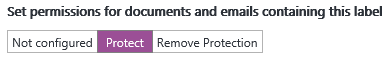
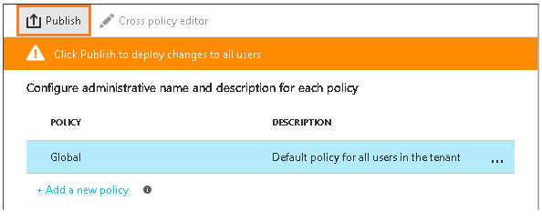

# Krok 2. Konfigurowanie i publikowanie zasad usługi Azure Information Protection

>*Dotyczy: Azure Information Protection*

Usługa Azure Information Protection zawiera domyślną zasadę, której można użyć bez konfiguracji, ale chcemy się jej przyjrzeć i wprowadzić kilka zmian.

1. W nowym oknie przeglądarki zaloguj się w witrynie [Azure Portal](https://portal.azure.com) jako administrator globalny swojej dzierżawy.

2. W menu centralnym kliknij przycisk **Nowy**, a następnie z listy **MARKETPLACE** wybierz opcję **Zabezpieczenia i tożsamość**. W bloku **Zabezpieczenia i tożsamość** wybierz z listy **POLECANE APLIKACJE** opcję **Azure Information Protection**. W bloku **Azure Information Protection** kliknij przycisk **Utwórz**.

    Spowoduje to uaktywnienie usługi dla dzierżawy i utworzenie bloku **Azure Information Protection**, dzięki czemu przy następnym logowaniu w portalu będzie można wybrać usługę z listy centralnej **Więcej usług**. 

    > [!TIP] 
    > Wybierz opcję **Przypnij do pulpitu nawigacyjnego**, aby utworzyć kafelek usługi **Azure Information Protection** na pulpicie nawigacyjnym, dzięki czemu można będzie pominąć krok przeglądania w poszukiwaniu usługi przy następnym zalogowaniu w witrynie portalu.

3.  Eksploruj automatycznie wyświetlony blok **Zasady: Globalne** zawierający domyślne zasady usługi Information Protection, które są tworzone automatycznie dla dzierżawcy:
    
    - Etykiety klasyfikacji: **Osobiste**, **Publiczne**, **Ogólne**, **Poufne** i **Wysoce poufne**. Dwie ostatnie etykiety można rozszerzyć, aby wyświetlić etykiety podrzędne: **Wszyscy pracownicy** i **Każdy (niechronione)**. Są to przykłady podkategorii klasyfikacji.
    
       > [!NOTE]
       > Twoje zasady domyślne mogą się nieco różnić od podanych w tym samouczku. Na przykład możesz mieć etykietę o nazwie **Wewnętrzne** zamiast **Ogólne** i **Tajne** zamiast **Wysoce poufne**. Jeśli tak jest, prawdopodobnie używasz starszej wersji zasad domyślnych. Lub dokonałeś ich samodzielnej edycji przed uruchomieniem samouczka.
       > 
       > Jeśli Twoje domyślne zasady wyglądają inaczej, nadal możesz używać tego samouczka, ale należy pamiętać o tych zmianach, korzystając z poniższych instrukcji i obrazów. Jeśli chcesz zmodyfikować zasady domyślne tak, aby pasowały do bieżących zasad domyślnych, zobacz [Domyślne zasady usługi Azure Information Protection](../deploy-use/configure-policy-default.md).

    - W przypadku domyślnej konfiguracji niektóre etykiety nie mają skonfigurowanych oznaczeń wizualnych (takich jak stopka, nagłówek i znak wodny) i żadna z tych etykiet nie ma ustawionej ochrony: 
    
    
    
    Ponadto istnieją ustawienia zasad, które nie są ustawione, tak więc, na przykład, nie jest wymagane, aby wszystkie dokumenty i wiadomości e-mail miały etykietę, brak jest etykiety domyślnej i użytkownicy nie muszą uzasadniać zmiany etykiet:
    
    

## Zmiana ustawień domyślnej etykiety i monit o uzasadnienie

W naszym samouczku zmienimy kilka z tych ustawień zasad, aby zobaczyć, jak działają:

1. Ustaw wartość opcji **Wybierz etykietę domyślną** na **Ogólne**. 

    Jeśli nie masz tej etykiety, ponieważ masz starszą wersję zasad, wybierz **Wewnętrzne** jako równoważną etykietę.

2. Dla opcji **Użytkownik musi podać uzasadnienie, aby ustawić niższą etykietę klasyfikacji, usunąć etykietę lub usunąć ochronę** wybierz wartość **Włączone**.

## Konfigurowanie etykiety ochrony, znaku wodnego oraz warunku monitowania o klasyfikację

Zmienimy teraz ustawienia jednej z podrzędnych etykiet **Wszyscy pracownicy** głównej etykiety **Poufne**. 

Jeśli etykieta **Poufne** nie ma podrzędnych etykiet, ponieważ masz starszą wersję zasad, możesz zamiast niej użyć etykiety **Poufne**. Kroki konfiguracji będą takie same, ale nazwą bloku etykiety będzie **Poufne** zamiast **Wszyscy pracownicy**.

1. Upewnij się, że etykieta **Poufne** jest rozwinięta, a następnie z tej etykiety wybierz pozycję **Wszyscy pracownicy**.
    
    W nowym bloku **Etykieta: Wszyscy pracownicy** zostaną teraz wyświetlone ustawienia dostępne dla każdej etykiety. 

2. Odczytaj tekst **Opisu** dla tej etykiety. Opisuje on sposób zamierzonego użycia wybranej etykiety i jest widoczny dla użytkowników jako etykietka narzędzia pomagająca im zdecydować, którą etykietę wybrać.

3. Odszukaj sekcję **Ustaw uprawnienia do dokumentów i wiadomości e-mail zawierających tę etykietę** i wybierz pozycję **Chroń**:
    
     
    
    Spowoduje to otwarcie bloku **Ochrona**.
    
3. Upewnij się, że w bloku **Ochrona** jest zaznaczona opcja **Azure RMS** oraz że zaznaczono również opcję **Wybierz szablon**, a następnie kliknij pole listy rozwijanej i wybierz domyślny szablon **\<nazwa organizacji> — Poufne**.     
    
    Na przykład jeśli nazwą firmy jest VanArsdel, Ltd, zobaczysz opcję **VanArsdel, Ltd — Poufne**, którą wybierzesz: 
    
    
    
    Jeśli ten szablon domyślny usługi Azure Rights Management został wyłączony, wybierz szablon alternatywny. Jednak w przypadku wybrania szablonu działu upewnij się, czy Twoje konto znajduje się w jego zakresie.
    
4. Kliknij przycisk **OK**, aby zapisać zmiany, co spowoduje zamknięcie bloku **Ochrona**. Swoją konfigurację zobaczysz w bloku **Etykieta: Wszyscy pracownicy**:
    
    
    
5. Teraz w bloku **Etykieta: Wszyscy pracownicy** odszukaj sekcję **Ustawianie oznaczenia wizualnego**:
    
    Dla ustawienia **Dokumenty z tą etykietą mają znak wodny** kliknij opcję **Włącz**, a następnie wpisz nazwę swojej organizacji w polu **Tekst**. W naszym przykładzie: **VanArsdel, Ltd**: 
    
    
    
    Można zmienić rozmiar, kolor i układ znaków wodnych, ale chwilowo pozostawimy wartości domyślne tych ustawień.
    
6. Zlokalizuj sekcję **Konfigurowanie warunków automatycznego stosowania tej etykiety**:
    
    Kliknij przycisk **Dodaj nowy warunek** i następnie w bloku **Warunek** wykonaj następujące czynności:
    
    a. **Wybierz typ warunku**: zachowaj wartość domyślną **Wbudowany**.
    
    b. **Wybierz wbudowany**: z listy rozwijanej wybierz opcję **Numer karty kredytowej**.
    
    c. **Minimalna liczba wystąpień**: zachowaj ustawienie domyślne **1**.
    
    d. **Zliczaj tylko wystąpienia o unikatowych wartościach**: zachowaj wartość domyślną **Wł**.
    
    
    
    Kliknij przycisk **Zapisz**, aby powrócić do bloku **Etykieta: Wszyscy pracownicy**.

7. W bloku **Etykieta: Wszyscy pracownicy** zobaczysz, że jako **NAZWA WARUNKU** jest wyświetlany **Numer karty kredytowej** z opcją **WYSTĄPIENIA** równą **1**:
    
    

8. Dla opcji **Wybierz sposób stosowania tej etykiety**: zachowaj wartość domyślną **Zalecany** i nie zmieniaj domyślnej wskazówki zasad:
    
    

9. W polu **Wprowadź informacje dla celów wewnętrznych** wpisz **Tylko do testów**:
    
    

10. Kliknij przycisk **Zapisz** w tym bloku **Etykieta: Wszyscy pracownicy**. Następnie ponownie kliknij przycisk **Zapisz** w bloku **Zasady: Globalne**.
    
    Na tym etapie Twoje etykiety będą teraz zawierać ochronę usług Azure RMS dla etykiety, która właśnie została skonfigurowana:

    
    
    Ustawienia zostały skonfigurowane wraz ze zmianami etykiety domyślnej i uzasadnieniem:
    
    
    
11. Aby po wprowadzeniu i zapisaniu zmian udostępnić je użytkownikom, w bloku początkowym **Azure Information Protection** należy kliknąć opcję **Opublikuj**, a następnie przycisk **Tak**, aby potwierdzić wybór.

    

Po zakończeniu tego samouczka możesz zamknąć portal Azure lub zostawić otwarty w celu wypróbowania innych opcji konfiguracji.

Skoro przyjrzeliśmy się już domyślnej zasadzie i wprowadziliśmy w niej kilka zmian, następnym krokiem jest zainstalowanie klienta usługi Azure Information Protection.

|Jeśli potrzebujesz dodatkowych informacji|Dodatkowe informacje|
|--------------------------------|--------------------------|
|Informacje o opcjach konfiguracji zasad|[Konfigurowanie zasad usługi Azure Information Protection](../deploy-use/configure-policy.md)|

>[!div class="step-by-step"]
[&#171; Krok 1](infoprotect-tutorial-step1.md)
[Krok 3 &#187;](infoprotect-tutorial-step3.md)

[!INCLUDE[Commenting house rules](../includes/houserules.md)]