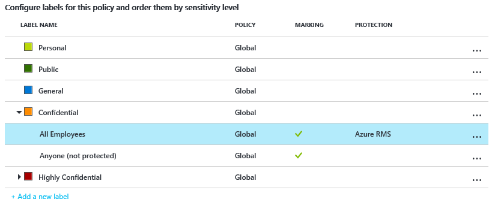

# Krok 2: Konfigurowanie zasad usługi Azure Information Protection

>*Dotyczy: [usługi Azure Information Protection](https://azure.microsoft.com/pricing/details/information-protection)*

Usługa Azure Information Protection zawiera domyślną zasadę, której można użyć bez konfiguracji, ale chcemy się jej przyjrzeć i wprowadzić kilka zmian.

1. Kontynuując [kroku 1](infoprotect-tutorial-step1.md) i nadal w witrynie Azure portal wybierz **klasyfikacje** > **zasady** > **Global** otworzyć **zasady: globalne** bloku. Ten blok zawiera domyślne zasady usługi Azure Information Protection, który jest tworzony dla Twojej dzierżawy.

2. Poświęć kilka minut, o których zapoznawanie się z etykiet, które są wyświetlane:
    
    - Etykiety klasyfikacji: **Osobiste**, **Publiczne**, **Ogólne**, **Poufne** i **Wysoce poufne**. Dwie ostatnie etykiety rozszerzyć, aby wyświetlić etykiet podrzędnych, które zawierają przykłady klasyfikacji można podkategorie:
    
       > [!NOTE]
       > Twoje zasady domyślne mogą się nieco różnić od podanych w tym samouczku. Na przykład możesz mieć etykietę o nazwie **Wewnętrzne** zamiast **Ogólne** i **Tajne** zamiast **Wysoce poufne**. Być może nie masz etykiet podrzędnych, o nazwie **tylko adresaci**, lub użytkownik nie ma etykiety na wszystkich. Te zmiany są, ponieważ istnieją różne wersje zasad domyślnych, w zależności od tego, kiedy został utworzony dla Twojej dzierżawy. Lub dokonałeś ich samodzielnej edycji przed uruchomieniem samouczka.
       > 
       > Jeśli Twoje domyślne zasady wyglądają inaczej, nadal możesz używać tego samouczka, ale należy pamiętać o tych zmianach, korzystając z poniższych instrukcji i obrazów. Jeśli chcesz zmodyfikować zasady domyślne tak, aby pasowały do bieżących zasad domyślnych, zobacz [Domyślne zasady usługi Azure Information Protection](../deploy-use/configure-policy-default.md).
    
    - W przypadku domyślnej konfiguracji niektóre etykiety nie mają skonfigurowane oznaczenia wizualne. Znaczniki wizualne są stopka, nagłówek i znak wodny. W zależności od zasady domyślne niektóre etykiety może być również ma ustawionej ochrony. Przykład: 
    
    
    
3. Po etykietach w **Konfiguruj ustawienia wyświetlania i Zastosuj Information Protection, użytkownicy końcowi** sekcji Zobacz też niektóre ustawienia zasad. Na przykład nie jest domyślne etykiety, dokumentów i wiadomości e-mail nie muszą mieć etykietę i użytkownicy nie muszą uzasadniać zmiany etykiet:
    
    

## Zmiana ustawień domyślnej etykiety i monit o uzasadnienie

W tym samouczku zmienimy kilka ustawień zasad, aby zobaczyć, jak działają:

1. Aby uzyskać **wybierz etykietę domyślną**, wybierz opcję **ogólne**. 

    Jeśli nie masz tej etykiety, ponieważ masz starszą wersję zasad, wybierz **Wewnętrzne** jako równoważną etykietę.

2. Aby uzyskać **użytkownik musi podać uzasadnienie, aby ustawić niższą etykietę klasyfikacji, usunąć etykietę lub usunąć ochronę**, ustaw tę opcję na **na**.

3. Ponadto, Znajdź ustawienie **Udostępnij opcję niestandardowych uprawnień użytkownikom**. Jeśli to ustawienie jest **poza**, zmień ją na **na**.
    
    Nie może być konieczne ustawienie to można zmienić, ponieważ wartość domyślna zależy od daty uzyskano subskrypcję. Firma Microsoft użyje uprawnienia niestandardowe w dalszej części tego samouczka udostępnianie chronionego dokumentu z użytkownikiem, który jest określany podczas kliknij prawym przyciskiem myszy plik w Eksploratorze plików.

4. Wybierz **Zapisz** na tym **zasady: globalne** bloku i jeśli zostanie wyświetlony monit o potwierdzenie tej akcji, wybierz opcję **OK**. Zamknij ten blok.

## Tworzenie nowej etykiety dla ochrony, oznaczeń wizualnych oraz warunku monitowania o klasyfikację

Teraz utworzymy nowe etykiety podrzędnej, aby uzyskać **poufne**.

1. Z **klasyfikacje** > **etykiety** opcji menu: kliknij prawym przyciskiem myszy **poufne** etykiety, a następnie wybierz **Dodaj etykietę podrzędną**.
    
    Jeśli użytkownik nie ma etykietę o nazwie **poufne**, możesz wybrać inną etykietę, lub możesz zamiast tego utwórz nową etykietę i nadal wykonać kroki samouczka z niewielkimi modyfikacjami.

2. Na **etykietę podrzędną** bloku, określ nazwę etykiety **Finance** i Dodaj następujący opis: **poufnych danych, który zawiera informacje finansowe, który jest ograniczony do pracowników tylko**.
    
    Ten tekst opisuje, jak ustawienia wybranej etykiety jest przeznaczony do użycia, i jest widoczny dla użytkowników jako etykietka narzędzia pomagająca im zdecydować, którą etykietę wybrać.

3. W sekcji **Ustaw uprawnienia do dokumentów i wiadomości e-mail zawierających tę etykietę** wybierz pozycję **Chroń**, a następnie **Ochrona**:
    
     
    
4. Na **ochrony** bloku, upewnij się, że **Azure (klucz w chmurze)** jest zaznaczone. Ta opcja używa usługi Azure Rights Management do ochrony dokumentów i wiadomości e-mail. Ponadto upewnij się, że **Set Permissions** opcja jest zaznaczona. Następnie wybierz pozycję **Dodaj uprawnienia**.

5. Na **Dodaj uprawnienia** bloku wybierz **Dodaj \<nazwa organizacji > — wszystkie elementy członkowskie**. Na przykład jeśli nazwą firmy jest VanArsdel, Ltd, zobaczysz następujące możliwość dokonania wyboru:
    
     
    
    Ta opcja automatycznie wybiera wszystkich użytkowników w organizacji, którzy mogą mieć przyznane uprawnienia. Jednak można zobaczyć inne opcje, które można przeglądać i wyszukiwanie grup lub użytkowników w dzierżawie. Lub po wybraniu **wprowadź szczegóły** opcji można określić adresy e-mail poszczególnych lub nawet wszystkich użytkowników z innej organizacji.

6. Uprawnienia, wybierz **recenzenta** z listy wstępnie zdefiniowanych opcji. Zobacz, jak ten poziom uprawnień automatycznie udziela niektórych uprawnień na liście, ale nie wszystkie uprawnienia:
    
    
    
    Można wybrać różne poziomy uprawnień lub określić poszczególne prawa użytkowania za pomocą **niestandardowe** opcji. Jednak na potrzeby tego samouczka Zachowaj **recenzenta** opcji. Możesz eksperymentować z różnymi uprawnieniami później i przeczytaj, jak oni ograniczyć określeni użytkownicy czynności z chronionego dokumentu lub wiadomości e-mail.

7. Kliknij przycisk **OK** zamknąć to **Dodaj uprawnienia** bloku w którym zobaczysz sposób, w jaki **ochrony** bloku zaktualizowaniu aby odpowiadały konfiguracji. Przykład:
    
     
    
    Jeśli wybierzesz **Dodaj uprawnienia**, ta akcja powoduje otwarcie **Dodaj uprawnienia** blok ponownie, tak, że można dodawać kolejnych użytkowników i przyznać im uprawnienia innej. Na przykład udzielić tylko widok dostępu dla określonej grupy. Ale w tym samouczku będziemy informować o jeden zestaw uprawnień dla wszystkich użytkowników.

8. Przejrzyj i Zachowaj ustawienia domyślne dla wygaśnięcia zawartości i dostęp w trybie offline, a następnie kliknij **OK** Aby zapisać i zamknąć to **ochrony** bloku.

8. Po powrocie **etykietę podrzędną** bloku Znajdź **Ustawianie oznaczenia wizualnego** sekcji:
    
    Dla **dokumenty oznaczone tą etykietą mają stopkę** kliknij opcję **na**, a następnie dla **tekstu** wpisz **sklasyfikowane jako poufne** . 
    
    Dla ustawienia **Dokumenty z tą etykietą mają znak wodny** kliknij opcję **Włącz**, a następnie wpisz nazwę swojej organizacji w polu **Tekst**. Na przykład **VanArsdel, Ltd** 
    
    Można zmienić wygląd tych oznaczeń wizualnych, ale pozostanie ustawienia te wartości domyślne teraz.
    
9. Zlokalizuj sekcję **Konfigurowanie warunków automatycznego stosowania tej etykiety**:
    
    Kliknij przycisk **Dodaj nowy warunek** a następnie na **warunek** bloku wybierz następujące pozycje:
    
    a. **Wybierz typ warunku**: Zachowaj wartość domyślną **typów informacji**.
    
    b. W **wybierz typy informacji** pole wyszukiwania: typ **numer karty kredytowej**. W wynikach wyszukiwania wybierz **numer karty kredytowej**.
    
    c. **Minimalna liczba wystąpień**: zachowaj ustawienie domyślne **1**.
    
    d. **Zliczaj tylko wystąpienia o unikatowych wartościach**: zachowaj wartość domyślną **Wł**.
    
    
    
    Kliknij przycisk **Zapisz** aby powrócić do **etykietę podrzędną** bloku.

10. Na **etykietę podrzędną** bloku zobaczysz, że **numer karty kredytowej** jest wyświetlany jako **nazwa WARUNKU**, za pomocą **1**  **WYSTĄPIENIA**:
    
    

11. Aby uzyskać **wybierz sposób stosowania tej etykiety**: Zachowaj wartość domyślną **zalecane**, a nie zmieniaj domyślnej wskazówki zasad. 

12. W polu **Wprowadź informacje dla celów wewnętrznych** wpisz **Tylko do testów**.

13. Kliknij przycisk **Zapisz** na tym **etykietę podrzędną** bloku. Jeśli zostanie wyświetlony monit o potwierdzenie, kliknij przycisk **OK**. Nowa etykieta jest utworzona i zapisana, ale jeszcze nie zostały dodane do zasad.

14. Z **klasyfikacje** > **zasady** opcji menu: Wybierz **Global** ponownie, a następnie wybierz pozycję **apletu Dodaj lub usuń etykiety**link po etykietach.

15. Z **zasad: Dodaj lub usuń etykiety** bloku, wybierz etykietę, która właśnie utworzony, etykietę podrzędną o nazwie **Finance**i kliknij przycisk **OK**.

16. Na **zasady: globalne** bloku zobaczysz teraz Twoje nowe etykiety podrzędnej w globalnych zasad, która jest skonfigurowana pod kątem oznaczeń wizualnych i ochrony. Przykład:

    
    
    Zobaczysz również, czy ustawienia zostały skonfigurowane wraz ze zmianami etykiety domyślnej i uzasadnieniem:
    
    
    

17. Kliknij przycisk **Zapisz** na tym **zasady: globalne** bloku. Jeśli zostanie wyświetlony monit o potwierdzenie tej akcji, kliknij przycisk **OK**.

Po zakończeniu tego samouczka możesz zamknąć portal Azure lub zostawić otwarty w celu wypróbowania innych opcji konfiguracji.

Skoro przyjrzeliśmy się już domyślnej zasadzie i wprowadziliśmy w niej kilka zmian, następnym krokiem jest zainstalowanie klienta usługi Azure Information Protection.

|Jeśli potrzebujesz dodatkowych informacji|Dodatkowe informacje|
|--------------------------------|--------------------------|
|Domyślne zasady i różne wersje — informacje|[Domyślne zasady usługi Azure Information Protection](../deploy-use/configure-policy-default.md)|
|Konfigurowanie zasad — informacje|[Konfigurowanie zasad usługi Azure Information Protection](../deploy-use/configure-policy.md)|
|Szczegółowe instrukcje dotyczące konfigurowania etykiety dla ochrony|[Konfigurowanie etykiety w celu ochrony usługi Rights Management](../deploy-use/configure-policy-protection.md)|
|Szczegółowe informacje na temat uprawnień|[Konfigurowanie praw użytkowania dla usługi Azure Rights Management](../deploy-use/configure-usage-rights.md)|

>[!div class="step-by-step"]
[&#171; Krok 1](infoprotect-tutorial-step1.md)
[Krok 3 &#187;](infoprotect-tutorial-step3.md)

[!INCLUDE[Commenting house rules](../includes/houserules.md)]