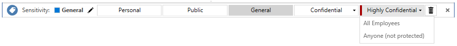

# Samouczek: Edytowanie zasad usługi Azure Information Protection i tworzenie nowej etykiety

>*Dotyczy: [usługi Azure Information Protection](https://azure.microsoft.com/pricing/details/information-protection)*

W tym samouczku dowiesz się, jak:
> [!div class="checklist"]
> * Konfigurowanie ustawień zasad
> * Tworzenie nowej etykiety 
> * Konfigurowanie etykiety pod kątem oznaczeń wizualnych, zaleca się klasyfikacji i ochrony
> * Zobacz swoje ustawienia i etykiety w działaniu

W wyniku tej konfiguracji użytkownicy widzą etykiety domyślnej, stosowane podczas tworzenia nowego dokumentu lub wiadomości e-mail. Jednakże są monitowani o zastosować nową etykietę, gdy zostanie wykryta informacje dotyczące kart kredytowych. Podczas stosowania nowej etykiety, zawartość jest sklasyfikowany i chronione przy użyciu odpowiedniego stopka i znak wodny. 

W tym samouczku można zakończyć w ciągu około 15 minut.

## Wymagania wstępne 

Do ukończenia tego samouczka, potrzebne są:

1. Subskrypcja, która obejmuje usługi Azure Information Protection Plan 2.
    
    Jeśli masz subskrypcję, która obejmuje usługi Azure Information Protection planu 2 możesz utworzyć [bezpłatne](https://portal.office.com/Signup/Signup.aspx?OfferId=87dd2714-d452-48a0-a809-d2f58c4f68b7) konta dla Twojej organizacji.

2. Został dodany do bloku usługi Azure Information Protection do witryny Azure portal i potwierdza, że aktywacji usługi ochrony.

    Jeśli potrzebujesz pomocy przy użyciu tych akcji, zobacz [Szybki Start: Dodawanie usługi Azure Information Protection do witryny Azure portal i Wyświetl zasady](quickstart-viewpolicy.md)

3. Klient usługi Azure Information Protection jest zainstalowany na tym komputerze. 
    
    Aby zainstalować klienta, przejdź do [Centrum pobierania Microsoft](https://www.microsoft.com/en-us/download/details.aspx?id=53018) i Pobierz **AzInfoProtection.exe** ze strony usługi Azure Information Protection.

4. Komputer z systemem Windows (co najmniej Windows 7 z dodatkiem Service Pack 1), a na tym komputerze, zalogowano Cię do aplikacji pakietu Office z jednej z następujących kategorii:
    
    - Usługa Office 365 z aplikacji pakietu Office 2016 (minimalna wersja 1805, kompilacja 9330.2078). Aby użyć tej opcji, Twoje konto musi mieć przypisaną licencję usługi Azure Rights Management. Ta licencja jest dołączone do subskrypcji usługi Azure Information Protection.
    
    - Usługi Office 365 Proplus z wersji aplikacji 2016 lub 2013 (Instalacja kliknij polecenie do uruchomienia lub opartych na Instalatorze Windows).
    
    - Office Professional Plus 2016.
    
    - Office Professional Plus 2013 z dodatkiem Service Pack 1.
    
    - Office Professional Plus 2010 z dodatkiem Service Pack 2.

Aby uzyskać pełną listę wymagań wstępnych do używania usługi Azure Information Protection, zobacz [wymagania dotyczące usługi Azure Information Protection](requirements.md).

Zaczynamy!

## Edytowanie zasad usługi Azure Information Protection

Przy użyciu portalu Azure, firma Microsoft będzie najpierw zmienić kilka ustawień zasad, a następnie utwórz nową etykietę.

### Edytowanie ustawień zasad

1. Otwórz nowe okno przeglądarki i zaloguj się do [witryny Azure portal](https://portal.azure.com) jako administrator globalny. Następnie przejdź do **usługi Azure Information Protection**. 
    
    Na przykład w menu Centrum kliknij pozycję **wszystkich usług** i zacznij wpisywać **informacji** w polu filtru. Wybierz pozycję **Azure Information Protection**.
    
    Jeśli nie jesteś administratorem globalnym, użyj następującego linku, dla alternatywnej ról: [logowania się do witryny Azure portal](configure-policy.md#signing-in-to-the-azure-portal)

2. Wybierz **klasyfikacje** > **zasady** > **Global** otworzyć **zasady: globalne** bloku. 

3. Znajdź ustawienia zasad po etykietach, w **Konfiguruj ustawienia wyświetlania i Zastosuj Information Protection, użytkownicy końcowi** sekcji. 
    
    Zanotuj jak aktualnie skonfigurowanych ustawień. W szczególności ustawienia **wybierz etykietę domyślną** i **użytkownik musi podać uzasadnienie, aby ustawić niższą etykietę klasyfikacji, usunąć etykietę lub usunąć ochronę**. Przykład:
    
    
    
    Użyjemy tych ustawień zasad w dalszej części tego samouczka, gdy będą one widoczne w działaniu.

4. Aby uzyskać **wybierz etykietę domyślną**, wybierz opcję **ogólne**. 

    Jeśli nie masz tej etykiety, ponieważ masz starszą wersję zasad, wybierz **Wewnętrzne** jako równoważną etykietę.

5. Dla **użytkownik musi podać uzasadnienie, aby ustawić niższą etykietę klasyfikacji, usunąć etykietę lub usunąć ochronę**, ustaw tę opcję na **na** , jeśli nie jest jeszcze.

6. Ponadto upewnij się, że **wyświetlany pasek Information Protection w aplikacjach pakietu Office** ustawiono **na**.

7. Wybierz **Zapisz** na tym **zasady: globalne** bloku i jeśli zostanie wyświetlony monit o potwierdzenie tej akcji, wybierz opcję **OK**. Zamknij ten blok.

### Tworzenie nowej etykiety dla ochrony, oznaczeń wizualnych oraz warunku monitowania o klasyfikację

Teraz utworzymy nowe etykiety podrzędnej, aby uzyskać **poufne**.

1. Z **klasyfikacje** > **etykiety** opcji menu: kliknij prawym przyciskiem myszy **poufne** etykiety, a następnie wybierz **Dodaj etykietę podrzędną**.
    
    Jeśli użytkownik nie ma etykietę o nazwie **poufne**, możesz wybrać inną etykietę, lub możesz zamiast tego utwórz nową etykietę i nadal wykonać kroki samouczka z niewielkimi modyfikacjami.

2. Na **etykietę podrzędną** bloku, określ nazwę etykiety **Finance** i Dodaj następujący opis: **poufnych danych, który zawiera informacje finansowe, który jest ograniczony do pracowników tylko**.
    
    Ten tekst opisuje, jak ustawienia wybranej etykiety jest przeznaczony do użycia, i jest widoczny dla użytkowników jako etykietka narzędzia pomagająca im zdecydować, którą etykietę wybrać.

3. W sekcji **Ustaw uprawnienia do dokumentów i wiadomości e-mail zawierających tę etykietę** wybierz pozycję **Chroń**, a następnie **Ochrona**:
    
     
    
4. Na **ochrony** bloku, upewnij się, że **Azure (klucz w chmurze)** jest zaznaczone. Ta opcja używa usługi Azure Rights Management do ochrony dokumentów i wiadomości e-mail. Ponadto upewnij się, że **Set Permissions** opcja jest zaznaczona. Następnie wybierz pozycję **Dodaj uprawnienia**.

5. Na **Dodaj uprawnienia** bloku wybierz **Dodaj \<nazwa organizacji > — wszystkie elementy członkowskie**. Na przykład jeśli nazwą firmy jest VanArsdel, Ltd, zobaczysz następujące możliwość dokonania wyboru:
    
     
    
    Ta opcja automatycznie wybiera wszystkich użytkowników w organizacji, którzy mogą mieć przyznane uprawnienia. Jednak można zobaczyć inne opcje, które można przeglądać i wyszukiwanie grup lub użytkowników w dzierżawie. Lub po wybraniu **wprowadź szczegóły** opcji można określić adresy e-mail poszczególnych lub nawet wszystkich użytkowników z innej organizacji.

6. Uprawnienia, wybierz **recenzenta** z listy wstępnie zdefiniowanych opcji. Zobacz, jak ten poziom uprawnień automatycznie udziela niektórych uprawnień na liście, ale nie wszystkie uprawnienia:
    
    
    
    Można wybrać różne poziomy uprawnień lub określić poszczególne prawa użytkowania za pomocą **niestandardowe** opcji. Jednak na potrzeby tego samouczka Zachowaj **recenzenta** opcji. Możesz eksperymentować z różnymi uprawnieniami później i przeczytaj, jak oni ograniczyć określeni użytkownicy czynności z chronionego dokumentu lub wiadomości e-mail.

7. Kliknij przycisk **OK** zamknąć to **Dodaj uprawnienia** bloku w którym zobaczysz sposób, w jaki **ochrony** bloku zaktualizowaniu aby odpowiadały konfiguracji. Przykład:
    
     
    
    Jeśli wybierzesz **Dodaj uprawnienia**, ta akcja powoduje otwarcie **Dodaj uprawnienia** blok ponownie, tak, że można dodawać kolejnych użytkowników i przyznać im uprawnienia innej. Na przykład udzielić tylko widok dostępu dla określonej grupy. Ale w tym samouczku będziemy informować o jeden zestaw uprawnień dla wszystkich użytkowników.

8. Przejrzyj i Zachowaj ustawienia domyślne dla wygaśnięcia zawartości i dostęp w trybie offline, a następnie kliknij **OK** Aby zapisać i zamknąć to **ochrony** bloku.

8. Po powrocie **etykietę podrzędną** bloku Znajdź **Ustawianie oznaczenia wizualnego** sekcji:
    
    Dla **dokumenty oznaczone tą etykietą mają stopkę** kliknij opcję **na**, a następnie dla **tekstu** wpisz **sklasyfikowane jako poufne** . 
    
    Dla ustawienia **Dokumenty z tą etykietą mają znak wodny** kliknij opcję **Włącz**, a następnie wpisz nazwę swojej organizacji w polu **Tekst**. Na przykład **VanArsdel, Ltd** 
    
    Można zmienić wygląd tych oznaczeń wizualnych, ale pozostanie ustawienia te wartości domyślne teraz.
    
9. Zlokalizuj sekcję **Konfigurowanie warunków automatycznego stosowania tej etykiety**:
    
    Kliknij przycisk **Dodaj nowy warunek** a następnie na **warunek** bloku wybierz następujące pozycje:
    
    a. **Wybierz typ warunku**: Zachowaj wartość domyślną **typów informacji**.
    
    b. Aby uzyskać **Wybierz branżę**: Zachowaj wartość domyślną **wszystkich**.
    
    c. W **wybierz typy informacji** pole wyszukiwania: typ **numer karty kredytowej**. W wynikach wyszukiwania wybierz **numer karty kredytowej**.
    
    d. **Minimalna liczba wystąpień**: zachowaj ustawienie domyślne **1**.
    
    e. **Zliczaj tylko wystąpienia o unikatowych wartościach**: zachowaj wartość domyślną **Wł**.
    
    
    
    Kliknij przycisk **Zapisz** aby powrócić do **etykietę podrzędną** bloku.

10. Na **etykietę podrzędną** bloku zobaczysz, że **numer karty kredytowej** jest wyświetlany jako **nazwa WARUNKU**, za pomocą **1**  **WYSTĄPIENIA**:
    
    

11. Aby uzyskać **wybierz sposób stosowania tej etykiety**: Zachowaj wartość domyślną **zalecane**, a nie zmieniaj domyślnej wskazówki zasad. 

12. W **Dodaj notatki przeznaczone dla administratorów** wpisz **tylko do celów testowych**.

13. Kliknij przycisk **Zapisz** na tym **etykietę podrzędną** bloku. Jeśli zostanie wyświetlony monit o potwierdzenie, kliknij przycisk **OK**. Nowa etykieta jest utworzona i zapisana, ale jeszcze nie zostały dodane do zasad.

14. Z **klasyfikacje** > **zasady** opcji menu: Wybierz **Global** ponownie, a następnie wybierz pozycję **apletu Dodaj lub usuń etykiety**link po etykietach.

15. Z **zasad: Dodaj lub usuń etykiety** bloku, wybierz etykietę, który został właśnie utworzony, etykietę podrzędną o nazwie **Finance**i kliknij przycisk **OK**.

16. Na **zasady: globalne** bloku zobaczysz teraz Twoje nowe etykiety podrzędnej w globalnych zasad, która jest skonfigurowana pod kątem oznaczeń wizualnych i ochrony. Przykład:

    
    
    Zobaczysz również, że ustawienia są skonfigurowane dla etykiety domyślnej i uzasadnieniem:
    
    
    

17. Kliknij przycisk **Zapisz** na tym **zasady: globalne** bloku. Jeśli zostanie wyświetlony monit o potwierdzenie tej akcji, kliknij przycisk **OK**.

Możesz zamknąć Azure portal lub zostawić otwarty w celu wypróbowania innych opcji konfiguracji, po ukończeniu tego samouczka.

Możesz wypróbować wyniki zmian.

## Zobacz klasyfikacji, etykietowania i ochrony w działaniu 

Wprowadzone zmiany zasad i nową etykietę, który został utworzony, dotyczy programu Word, Excel, PowerPoint i Outlook. Ale w tym samouczku użyjemy programu Word, aby zobaczyć je w działaniu. 

Otwórz nowy dokument programu Word. Ponieważ klient usługi Azure Information Protection jest zainstalowany, zostaną wyświetlone następujące czynności:

- Na **Home** karcie **ochrony** grupy za pomocą przycisku o nazwie **Chroń**.
    
    Kliknij przycisk **Chroń**  >  **Pomoc i opinie** i w oknie dialogowym **Microsoft Azure Information Protection** potwierdź swój status klienta. Powinna zostać wyświetlona informacja **Połączono jako** i nazwa użytkownika. Ponadto powinna także zostać wyświetlona godzina i Data ostatniego połączenia i zostało pobrane zasady usługi Information Protection. Sprawdź, czy jest wyświetlana Twoja nazwa użytkownika odpowiednia dla Twojej dzierżawy.

- Pod wstążką jest wyświetlany nowy pasek o nazwie Information Protection. Wyświetla tytuł **czułości**i etykiety, które widzieliśmy w witrynie Azure portal.

### Aby ręcznie zmienić naszą domyślną etykietę

1. Na pasku usługi Information Protection wybierz ostatnią etykietę i zobacz, jak wyświetlać etykiet podrzędnych:
    
    

2. Wybierz jedną z tych etykiet podrzędnych, i zobacz, jak inne etykiety nie są już wyświetlane na pasku po tym samym etykietę dla tego dokumentu. **Czułości** zmiany wartości, aby wyświetlić etykiety i etykiety podrzędnej, nazwij analogiczna zmiana koloru etykiety. Przykład:
    
    

3. Na pasku usługi Information Protection kliknij ikonę **Edytuj etykietę** obok aktualnie wybranej wartości etykiety:
    
    
    
    Ta akcja ponownie wyświetli dostępne etykiety.

4. Teraz wybierz pierwszą etykietę **Osobiste**. Ponieważ wybrano etykiety mającej niższą klasyfikację niż etykieta wcześniej wybrana dla tego dokumentu zostanie wyświetlony monit o uzasadnienie, dlaczego one obniżenia poziomu klasyfikacji:
    
    
    
    Wybierz opcję **Poprzednia etykieta już nie obowiązuje** i kliknij przycisk **Potwierdź**. Wartość opcji **Ważność** zostanie zmieniona na **Osobiste** i pozostałe etykiety zostaną ponownie ukryte.

### Aby całkowicie usunąć klasyfikację

1. Na pasku o nazwie Information Protection kliknij ponownie ikonę **Edytuj etykietę**. Zamiast wybierać jedną z etykiet kliknij ikonę **Usuń etykietę**:
    
    
    
2. Tym razem, gdy zostanie wyświetlony monit, wpisz "ten dokument nie wymaga klasyfikacji" i kliknij przycisk **Potwierdź**.  
    
    Zostanie wyświetlony **czułości** wartością wyświetlaną **Nieustawione**, który jest widoczny dla użytkowników początkowo nowych dokumentów, jeśli nie ustawisz etykiety domyślnej jako ustawienie zasad.

### Aby wyświetlić monit zalecający etykietowanie i automatyczne włączanie ochrony

1. W dokumencie programu Word wpisz poprawny numer karty kredytowej, na przykład: **4242-4242-4242-4242**. 

2. Zapisz dokument lokalnie, za pomocą dowolnej nazwy pliku. 

3. Teraz zostanie wyświetlony monit o zastosowanie etykiety, która została skonfigurowana do ochrony w przypadku wykrycia numerów kart kredytowych. Jeśli nie zgadzamy się z zaleceniem, nasze ustawienie zasad umożliwia nam jego odrzucenie po wybraniu pozycji **Odrzuć**. Przekazanie zalecenia, jednocześnie umożliwiając użytkownikowi zastąpienie go, pomaga zmniejszyć liczbę fałszywych alarmów podczas korzystania z automatycznej klasyfikacji. W przypadku tego samouczka kliknij pozycję **Zmień teraz**.

    

    Oprócz dokumencie informacji o zastosowaniu skonfigurowanej etykiety (na przykład **poufne \ Finanse**), natychmiast zobaczysz znak wodny z nazwą organizacji na stronie oraz stopka  **Sklasyfikowane jako poufne** jest również zastosowane. 

    Dokument jest również chroniony przy użyciu uprawnień, które określone dla tej etykiety. Możesz sprawdzić, czy dokument jest chroniony przez kliknięcie przycisku **pliku** kartę i wyświetlając informację **Chroń dokument**. Zobacz, czy dokument jest chroniony przez **poufne \ Finanse** i opis etykiety. 
    
    Ze względu na konfigurację ochrony etykiety tylko pracownicy mogą otwierać dokument, a niektóre akcje są ograniczone do nich. Na przykład ponieważ nie mają Drukuj i kopii i Wyodrębnij zawartość uprawnień, ich nie można drukować dokument lub kopiowania z niego. Takie ograniczenia pomóc uniknąć utraty danych. Jako właściciel dokumentu możesz wydrukować i skopiuj z niego. Jednak jeśli możesz wysłać wiadomość e-mail dokument innemu użytkownikowi w organizacji, nie można wykonać te akcje.

4. Możesz zamknąć ten dokument.

## Oczyszczanie zasobów

Jeśli nie chcesz zachować zmiany wprowadzone w ramach tego samouczka, wykonaj następujące czynności:

1. Wybierz **klasyfikacje** > **zasady** > **Global** otworzyć **zasady: globalne** bloku.

2. Powrócić do ich oryginalnych wartości, które miały Zanotuj ustawień zasad, a następnie wybierz **Zapisz**. 

3. Z **klasyfikacje** > **etykiety** opcji menu: na **usługi Azure Information Protection — etykieta** bloku, wybierz menu kontekstowe (**...**) dla **Finance** utworzonej etykiety.

4. Wybierz **usunąć tę etykietę** i jeśli zostanie wyświetlony monit o potwierdzenie, wybierz **OK**.

Uruchom ponownie program Word, aby pobrać te zmiany.

## Kolejne kroki

Aby uzyskać więcej informacji na temat edytowania zasad usługi Azure Information Protection, zobacz [zasad konfigurowania usługi Azure Information Protection](configure-policy.md).

Aby uzyskać więcej informacji na temat której etykietowania działanie jest rejestrowane, zobacz [rejestrowanie użycia klienta usługi Azure Information Protection](./rms-client/client-admin-guide-files-and-logging.md#usage-logging-for-the-azure-information-protection-client).

