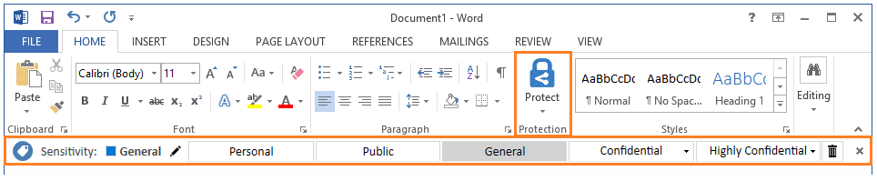

# Podręcznik administratora klienta usługi Azure Information Protection

>*Dotyczy: usługi Active Directory Rights Management, Azure Information Protection, Windows 10, Windows 8.1, Windows 8, Windows 7 z dodatkiem SP1, Windows Server 2016, Windows Server 2012 R2, Windows Server 2012, Windows Server 2008 R2*

Informacje zawarte w tym przewodniku są przydatne dla osób odpowiedzialnych za klienta usługi Azure Information Protection w sieci przedsiębiorstwa lub chcącym uzyskać więcej informacji technicznych, niż jest dostępnych w [podręczniku użytkownika klienta usługi Azure Information Protection](client-user-guide.md). 

Na przykład:

- Opis różnych składników tego klienta i określenie, czy należy je zainstalować

- Jak zainstalować klienta dla użytkowników, z informacjami na temat wymagań wstępnych, opcji instalacji i parametrów oraz weryfikowania

- Jak obsłużyć konfiguracje niestandardowe, które często wymagają edycji rejestru

- Lokalizowanie plików klienta i dzienników użycia

- Identyfikowanie typów plików obsługiwanych przez klienta

- Konfigurowanie i używanie witryny śledzenia dokumentów dla użytkowników

- Użycie klienta z programem PowerShell w celu sterowania z poziomu wiersza polecenia

**Czy masz pytanie, na które nie ma odpowiedzi w tej dokumentacji?** Odwiedź [witrynę Yammer usługi Azure Information Protection](https://www.yammer.com/AskIPTeam). 

## Omówienie aspektów technicznych klienta usługi Azure Information Protection

Klient usługi Azure Information Protection zawiera następujące elementy:

- Dodatek do pakietu Office instalujący pasek usługi Azure Information Protection, który umożliwia użytkownikom wybieranie etykiet klasyfikacji, oraz przycisk **Chroń** na Wstążce udostępniający dodatkowe opcje.

- Opcje dostępne po kliknięciu prawym przyciskiem myszy w oknie Eksploratora plików Windows, które pozwalają użytkownikom stosować etykiety klasyfikacji i ochronę plików.

- Przeglądarka do wyświetlania chronionych plików, gdy natywna aplikacja nie może ich otworzyć.

- Moduł środowiska PowerShell pozwalający dodawać i usuwać etykiety klasyfikacji oraz włączać i wyłączać ochronę plików.

- Klient usługi Rights Management komunikujący się z usługą Azure Rights Management (Azure RMS) lub usługami Active Directory Rights Management (AD RMS).

Klient usługi Azure Information Protection najlepiej nadaje się do pracy z usługami Azure — usługą Azure Information Protection i jej usługami ochrony danych, Azure Rights Management. Jednak z pewnymi ograniczeniami klient usługi Azure Information Protection działa też z lokalną wersją usług Rights Management — AD RMS. Obszerne porównanie funkcji obsługiwanych przez usługi Azure Information Protection i AD RMS można znaleźć w artykule [Porównanie usług Azure Information Protection i AD RMS](../understand-explore/compare-azure-rms-ad-rms.md). 

Jeśli korzystasz z usług AD RMS i chcesz przeprowadzić migrację do usługi Azure Information Protection, zobacz [Migrowanie z usługi AD RMS do usługi Azure Information Protection](../plan-design/migrate-from-ad-rms-to-azure-rms.md).

## Czy należy wdrożyć klienta usługi Azure Information Protection?

Dokonaj wdrożenia klienta usługi Azure Information Protection w następujących przypadkach:

- Chcesz klasyfikować (i ewentualnie chronić) dokumenty i wiadomości e-mail, wybierając etykiety w aplikacjach pakietu Office (Word, Excel, PowerPoint, Outlook).

- Chcesz klasyfikować (i ewentualnie chronić) dokumenty i wiadomości e-mail za pomocą Eksploratora plików, który obsługuje dodatkowe typy plików, wybór wielokrotny i foldery.

- Chcesz uruchamiać skrypty, które klasyfikują (i ewentualnie chronią) dokumenty za pomocą poleceń środowiska PowerShell.

- Chcesz wyświetlać chronione dokumenty, gdy natywna aplikacja wyświetlająca je nie jest zainstalowana lub nie może otworzyć tych dokumentów.

- Chcesz po prostu chronić pliki za pomocą Eksploratora plików lub poleceń środowiska Powershell.

- Chcesz umożliwić użytkownikom i administratorom śledzenie i odwoływanie chronionych dokumentów.

- Chcesz usuwać szyfrowanie z plików i kontenerów (wyłączać ochronę) w trybie zbiorczym na potrzeby odzyskiwania danych.

- Korzystasz z pakietu Office 2010 i chcesz chronić dokumenty i wiadomości e-mail za pomocą usługi Azure Rights Management.

Przykład ukazujący dodatek klienta usługi Azure Information Protection w aplikacji pakietu Office, który wyświetla etykiety klasyfikacji dla danej organizacji i nowy przycisk **Chroń** na wstążce:

## Jak zainstalować klienta usługi Azure Information Protection dla użytkowników

Przed zainstalowaniem klienta sprawdź, czy komputer ma wymagane wersje systemu operacyjnego i aplikacji dla usługi Azure Information Protection: [Wymagania dla usługi Azure Information Protection](../get-started/requirements-azure-rms.md). 

Następnie sprawdź dodatkowe wymagania wstępne dla klienta usługi Azure Information Protection.

### Dodatkowe wymagania wstępne dla klienta usługi Azure Information Protection

- Microsoft .NET Framework 4.6.2
    
    Do zainstalowania pełnej wersji klienta usługi Azure Information Protection jest domyślnie wymagany program Microsoft .NET Framework w wersji 4.6.2 lub wyższej. W przypadku jego braku Instalator spróbuje pobrać i zainstalować ten wymagany program. Jeśli ten wymagany program jest instalowany w ramach instalacji klienta, należy uruchomić ponownie komputer. Chociaż nie jest to zalecane, można pominąć to wymaganie wstępne, korzystając z [parametru instalacji niestandardowej](#more-information-about-the-downgradedotnetrequirement-installation-parameter).

- Microsoft .NET Framework 4.5.2
    
    Jeśli przeglądarka usługi Azure Information Protection jest instalowana oddzielnie, wymagany jest program Microsoft .NET Framework w wersji 4.5.2 lub wyższej. W przypadku jego braku Instalator nie pobierze i nie zainstaluje tego programu.

- Wersja 4.0 programu Windows PowerShell
    
    Moduł PowerShell dla klienta wymaga środowiska Windows PowerShell w wersji 4.0, co może powodować konieczność zainstalowania go w starszych systemach operacyjnych. Aby uzyskać więcej informacji, zobacz artykuł [How to Install Windows PowerShell 4.0](http://social.technet.microsoft.com/wiki/contents/articles/21016.how-to-install-windows-powershell-4-0.aspx) (Jak zainstalować program Windows PowerShell 4.0). Instalator nie sprawdza ani nie instaluje tego wymagania wstępnego. Aby sprawdzić, która wersja programu Windows PowerShell jest używana, wpisz polecenie `$PSVersionTable` w sesji programu PowerShell.

- Asystent logowania w Usługach online firmy Microsoft 7.250.4303.0
    
    Komputery z pakietem Office 2010 wymagają Asystenta logowania w Usługach online firmy Microsoft w wersji 7.250.4303.0. Ta wersja jest dołączana do pakietu instalacji klienta. Jeśli masz Asystenta logowania w nowszej wersji, należy go odinstalować przed zainstalowaniem klienta usługi Azure Information Protection. Na przykład sprawdź wersję i odinstaluj Asystenta logowania, wybierając opcje **Panel sterowania** > **Programy i funkcje** > **Odinstaluj lub zmień program**.

- Aktualizacja KB 2533623
    
    Komputery z systemem Windows 7 z dodatkiem Service Pack 1 wymagają aktualizacji KB 2533623. Aby uzyskać więcej informacji o tej aktualizacji, zobacz temat [Microsoft Security Advisory: Załadowanie niezabezpieczonej biblioteki umożliwia zdalne wykonywanie kodu](https://support.microsoft.com/en-us/kb/2533623). Tę aktualizację można zainstalować bezpośrednio lub może ona zostać zastąpiona przez inną aktualizację, która zainstaluje ją automatycznie.
    
    Jeśli ta aktualizacja jest wymagana i nie została zainstalowana, instalator klienta wyświetla ostrzeżenie z informacją, że należy ją zainstalować. Tę aktualizację można zainstalować po zainstalowaniu klienta, ale niektóre czynności zostaną zablokowane i ponownie pojawi się komunikat.  

- Nie należy wyłączać dodatku **Microsoft Azure Information Protection** dla aplikacji pakietu Office
    
    Jeśli skonfigurowano ustawienie zasad grupy **Lista zarządzanych dodatków**, dodaj dodatek Microsoft Azure Information Protection dla aplikacji pakietu Office, określając następujące identyfikatory programowe (ProgID) dla usługi Azure Information Protection, a następnie ustaw opcję na wartość **1: Dodatek jest zawsze włączony**.
    
    - Dla programu Outlook: `MSIP.OutlookAddin`
    
    - Dla programu Word: `MSIP.WordAddin`
    
    - Dla programu Excel: `MSIP.ExcelAddin`
    
    - Dla programu PowerPoint: `MSIP.PowerPointAddin`
    
    Nawet jeśli nie skonfigurowano tego ustawienia zasad grupy **Lista zarządzanych dodatków**, konieczne może być skonfigurowanie go w przypadku otrzymywania raportów, że dodatek Microsoft Azure Information Protection zostanie wyłączony. Gdy ten dodatek jest wyłączony, użytkownicy nie widzą paska usługi Azure Information Protection w aplikacji pakietu Office.
    
    Aby uzyskać więcej informacji na temat tego ustawienia zasad grupy, zobacz [No Add-ins loaded due to group policy settings for Office 2013 and Office 2016 programs](https://support.microsoft.com/help/2733070/no-add-ins-loaded-due-to-group-policy-settings-for-office-2013-and-off) (Brak załadowanych dodatków z powodu ustawień zasad grupy dla pakietów Office 2013 i Office 2016).

> [!IMPORTANT]
> Instalacja klienta usługi Azure Information Protection wymaga lokalnych uprawnień administracyjnych.

### Opcje instalacji klienta usługi Azure Information Protection dla użytkowników

Istnieją trzy opcje instalacji klienta dla użytkowników:

**Windows Update**: klient usługi Azure Information Protection znajduje się również w wykazie usługi Microsoft Update, dzięki czemu można zainstalować i zaktualizować klienta przy użyciu dowolnej usługi aktualizacji oprogramowania korzystającej z wykazu.

**Uruchomienie pliku wykonywalnego (exe) klienta**: zalecana metoda instalacji, którą można uruchomić interaktywnie lub w trybie cichym. Ta metoda jest najbardziej elastyczna i jest metodą zalecaną, ponieważ Instalator sprawdza wiele wymagań wstępnych i może automatycznie zainstalować brakujące elementy. [Instrukcje](#to-install-the-azure-information-protection-client-by-using-the-executable-installer)

**Wdrażanie instalatora klienta systemu Windows (msi) **: obsługiwane w przypadku instalacji cichej wykorzystującej mechanizm wdrożenia centralnego, taki jak zasady grupy, program Configuration Manager i Microsoft Intune. Ta metoda jest niezbędna w przypadku komputerów z systemem Windows 10, które są zarządzane przez usługę Intune i aplikację MDM (Mobile Device Management), ponieważ dla tych komputerów pliki wykonywalne nie są obsługiwane przez instalację. Jednak w przypadku użycia tej metody instalacji należy ręcznie sprawdzić i zainstalować lub odinstalować oprogramowanie zależne, co w wypadku pliku wykonywalnego byłoby przeprowadzone przez instalator. [Instrukcje](#to-install-the-azure-information-protection-client-by-using-the-msi-installer)

### Aby zainstalować klienta usługi Azure Information Protection dla użytkowników przy użyciu instalatora wykonywalnego

Użyj poniższych instrukcji, aby zainstalować klienta bez korzystania z katalogu aktualizacji Microsoft Update ani wdrażania pliku msi przy użyciu metody wdrażania centralnego, jak w przypadku usługi Intune.

1. Pobierz wersję wykonywalną klienta usługi Azure Information Protection z [Centrum pobierania Microsoft](https://www.microsoft.com/en-us/download/details.aspx?id=53018). 
    
    Jeśli dostępna jest wersja zapoznawcza, zachowaj ją tylko do celów testowych. Nie jest ona przeznaczona dla użytkowników końcowych w środowisku produkcyjnym. 

2. W przypadku instalacji domyślnej wystarczy uruchomić plik wykonywalny, np. **AzInfoProtection.exe**. Jednak aby wyświetlić opcje instalacji, należy najpierw uruchomić plik wykonywalny z parametrem **/help**: `AzInfoProtection.exe /help`

    Przykład instalacji klienta w trybie dyskretnym: `AzInfoProtection.exe /quiet`
    
    Przykład instalacji jedynie poleceń cmdlet środowiska PowerShell w trybie dyskretnym: `AzInfoProtection.exe  PowerShellOnly=true /quiet`
    
    Dodatkowe parametry, które nie są wymienione na ekranie pomocy:
    
    - **ServiceLocation**: użyj tego parametru, jeśli instalujesz klienta na komputerach z pakietem Office 2010, a użytkownicy nie są administratorami lokalnymi na swoich komputerach lub jeśli nie chcesz, aby użytkownicy otrzymywali monity. [Więcej informacji](#more-information-about-the-servicelocation-installation-parameter) 
    
    - **DowngradeDotNetRequirement**: użyj tego parametru, aby pominąć wymaganie wstępne dotyczące programu Microsoft .NET Framework w wersji 4.6.2. [Więcej informacji](#more-information-about-the-downgradedotnetrequirement-installation-parameter)
    
    - **AllowTelemetry=0**: użyj tego parametru, aby wyłączyć opcję instalacji **Pomóż ulepszyć usługę Azure Information Protection, wysyłając statystyki użycia do firmy Microsoft**. 
    
3. W przypadku instalacji interaktywnej wybierz opcję zainstalowania **zasad demonstracyjnych**, jeśli nie możesz nawiązać połączenia z usługą Office 365 lub Azure Active Directory, ale chcesz zobaczyć i wypróbować klienta usługi Azure Information Protection przy użyciu zasad lokalnych w celach demonstracyjnych. Gdy klient nawiąże połączenie z usługą Azure Information Protection, te zasady demonstracyjne zostaną zastąpione zasadami usługi Azure Information Protection obowiązującymi w organizacji.
    
4. Aby ukończyć instalację: 

    - Ponownie uruchom komputer, jeśli jest na nim zainstalowany pakiet Office 2010. 
        
        Jeśli klienta zainstalowano bez parametru ServiceLocation, przy pierwszym uruchomieniu dowolnej aplikacji pakietu Office korzystającej z paska usługi Azure Information Protection (na przykład Word) należy potwierdzić wszystkie monity o zaktualizowanie rejestru w związku z pierwszym uruchomieniem. Klucze rejestru są wypełniane przy użyciu [odnajdywania usług](../rms-client/client-deployment-notes.md#rms-service-discovery). 
    
    - W przypadku innych wersji pakietu Office należy uruchomić ponownie wszystkie aplikacje pakietu Office i wszystkie wystąpienia Eksploratora plików. 
        
5. Aby potwierdzić, że instalacja zakończyła się pomyślnie, sprawdź plik dziennika instalacji, który domyślnie jest tworzony w folderze %temp%. Można zmienić tę lokalizację z użyciem parametru instalacji **/log**. 
 
    Ten plik ma następujący format nazwy: `Microsoft_Azure_Information_Protection_<number>_<number>_MSIP.Setup.Main.msi.log`
    
    Na przykład: **Microsoft_Azure_Information_Protection_20161201093652_000_MSIP. Setup.Main.msi.log**
    
    W tym pliku dziennika wyszukaj następujący ciąg: **Product: Microsoft Azure Information Protection -- Installation completed successfully.** (Produkt: Microsoft Azure Information Protection — Instalacja została pomyślnie ukończona). Jeśli instalacja nie powiodła się, ten plik dziennika zawiera szczegółowe informacje ułatwiające identyfikację i rozwiązywanie problemów.

#### Więcej informacji na temat parametru instalacji ServiceLocation

W przypadku instalowania klienta dla użytkowników pakietu Office 2010 nieposiadających lokalnych uprawnień administracyjnych należy określić parametr ServiceLocation i adres URL usługi Azure Rights Management. Te parametr i wartość tworzą oraz ustawiają następujące klucze rejestru:

HKEY_LOCAL_MACHINE\SOFTWARE\Wow6432Node\Microsoft\MSDRM\ServiceLocation\Activation

HKEY_LOCAL_MACHINE\SOFTWARE\Wow6432Node\Microsoft\MSDRM\ServiceLocation\EnterprisePublishing

HKEY_LOCAL_MACHINE\SOFTWARE\Microsoft\MSDRM\ServiceLocation\EnterprisePublishing

HKEY_LOCAL_MACHINE\SOFTWARE\Microsoft\MSDRM\ServiceLocation\Activation

Zidentyfikuj wartość do określenia dla parametru ServiceLocation, wykonując następującą procedurę. 

##### Aby zidentyfikować wartość do określenia dla parametru ServiceLocation

1. Z poziomu sesji programu PowerShell najpierw uruchom polecenie [Connect-AadrmService](https://docs.microsoft.com/powershell/aadrm/vlatest/connect-aadrmservice) i określ poświadczenia administratora, aby nawiązać połączenie z usługą Azure Rights Management. Następnie uruchom polecenie [Get-AadrmConfiguration](https://docs.microsoft.com/powershell/aadrm/vlatest/get-aadrmconfiguration). 
 
    Jeśli jeszcze nie zainstalowano modułu programu PowerShell dla usługi Azure Rights Management, zobacz [Instalowanie programu Windows PowerShell dla usługi Azure Rights Management](../deploy-use/install-powershell.md).

2. Opierając się na danych wyjściowych, zidentyfikuj wartość **LicensingIntranetDistributionPointUrl**.

    Na przykład: **LicensingIntranetDistributionPointUrl: https://5c6bb73b-1038-4eec-863d-49bded473437.rms.na.aadrm.com/_wmcs/licensing**

3. Usuń element **/_wmcs/licensing** z tego ciągu. Na przykład: **https://5c6bb73b-1038-4eec-863d-49bded473437.rms.na.aadrm.com**

    Wynikowy ciąg jest wartością do określenia dla parametru ServiceLocation.

Przykład instalacji klienta w trybie dyskretnym dla pakietu Office 2010 i usługi Azure RMS: `AzInfoProtection.exe /quiet ServiceLocation=https://5c6bb73b-1038-4eec-863d-49bded473437.rms.na.aadrm.com`

#### Więcej informacji na temat parametru instalacji DowngradeDotNetRequirement

Aby umożliwić obsługę automatycznych uaktualnień z użyciem usługi Windows Update oraz niezawodną integrację z aplikacjami pakietu Office, klient usługi Azure Information Protection korzysta z programu Microsoft .NET Framework w wersji 4.6.2. Podczas instalacji ma domyślnie miejsce sprawdzenie dostępności tej wersji, a w przypadku jej braku — próba jej instalacji. Następnie instalacja wymaga ponownego uruchomienia komputera.

Jeśli zainstalowanie nowszej wersji programu Microsoft .NET Framework nie jest możliwe, można zainstalować klienta z uwzględnieniem parametru i wartości **DowngradeDotNetRequirement=True**, co spowoduje pominięcie tego wymagania w przypadku, gdy na komputerze jest zainstalowany program Microsoft .NET Framework w wersji 4.5.1.

Na przykład: `AzInfoProtection.exe DowngradeDotNetRequirement=True`

Firma Microsoft zaleca zachowanie ostrożności przy stosowaniu tego parametru i używanie go ze świadomością, że są zgłaszane problemy z aplikacjami pakietu Office, które zawieszają się w przypadku użycia klienta usługi Azure Information Protection w połączeniu ze starszą wersją programu Microsoft .NET Framework. Jeśli aplikacje zaczną się zawieszać, uaktualnij program do zalecanej wersji przed zastosowaniem innych sposobów mających na celu rozwiązanie problemu. 

Pamiętaj również, że w przypadku użycia usługi Windows Update do uaktualniania klienta usługi Azure Information Protection konieczne będzie zastosowanie innego mechanizmu wdrażania oprogramowania w celu uaktualnienia klienta do nowszej wersji.

### Jak zainstalować klienta usługi Azure Information Protection dla użytkowników przy użyciu instalatora msi

W przypadku wdrożenia centralnego skorzystaj z poniższych informacji, które są specyficzne dla instalacji wersji msi klienta usługi Azure Information Protection. 

Jeśli metoda wdrażania oprogramowania korzysta z oprogramowania Intune, użyj tych instrukcji razem z informacjami z sekcji [Dodawania aplikacji przy użyciu usługi Intune](/intune/deploy-use/add-apps).

1. Pobierz wersję msi klienta usługi Azure Information Protection z [Centrum pobierania Microsoft](https://www.microsoft.com/en-us/download/details.aspx?id=53018). 
    
    Jeśli dostępna jest wersja zapoznawcza, zachowaj ją tylko do celów testowych. Nie jest ona przeznaczona dla użytkowników końcowych w środowisku produkcyjnym. 

2. Upewnij się, że następujące zależności oprogramowania zostały spełnione dla każdego komputera, na którym będzie uruchamiany plik msi. Na przykład umieść w pakiecie poniższe oprogramowanie razem z wersją msi klienta lub wdrażaj ją wyłącznie na komputerach, które spełniają te zależności:
    
    |Wersja pakietu Office|System operacyjny|Oprogramowanie|Akcja|
    |--------------------|--------------|----------------|---------------------|
    |Office 2016|Wszystkie obsługiwane wersje|64-bitowe: [KB317866](https://www.microsoft.com/en-us/download/details.aspx?id=55073)  32-bitowe: [KB317866](https://www.microsoft.com/en-us/download/details.aspx?id=55058)   Wersja: 1.0|Instalowanie|
    |Office 2013|Wszystkie obsługiwane wersje|64-bitowe: [KB3172523](https://www.microsoft.com/en-us/download/details.aspx?id=54992)   32-bitowe: [KB3172523](https://www.microsoft.com/en-us/download/details.aspx?id=54979)   Wersja: 1.0|Instalowanie|
    |Pakiet Office 2010|Wszystkie obsługiwane wersje|[Asystent logowania w Usługach online firmy Microsoft](https://www.microsoft.com/en-us/download/details.aspx?id=28177)   Wersja: 2.1|Instalowanie|
    |Pakiet Office 2010|Windows 8.1 i Windows Server 2012 R2|[KB2843630](https://www.microsoft.com/en-us/download/details.aspx?id=41708)   Numer wersji uwzględniony w nazwie pliku: v3|Zainstaluj Jeśli KB2843630 lub KB2919355 nie jest zainstalowana.|
    |Pakiet Office 2010|Windows 8 i Windows Server 2012|[KB2843630](https://www.microsoft.com/en-us/download/details.aspx?id=41708)   Numer wersji uwzględniony w nazwie pliku: v3|Instalowanie|
    |Pakiet Office 2010|Windows 7|[KB2843630](https://www.microsoft.com/en-us/download/details.aspx?id=41709)   Numer wersji uwzględniony w nazwie pliku: v3|Zainstaluj Jeśli KB3125574 nie jest zainstalowana.|
    |Nie dotyczy|Windows 7|KB2627273    Numer wersji uwzględniony w nazwie pliku: v4|Odinstalowanie|
    

3. W przypadku instalacji domyślnej uruchom plik msi z parametrem **/quiet**, na przykład `AzInfoProtection.msi /quiet`. Jednak może okazać się konieczne określenie dodatkowych parametrów instalacji, które są udokumentowane w [instrukcjach Instalatora wykonywalnego](#to-install-the-azure-information-protection-client-by-using-the-executable-installer).  

## Dodatkowe czynności kontrolne i rozwiązywanie problemów

Użyj opcji **Pomoc i opinie**, aby otworzyć okno dialogowe **Microsoft Azure Information Protection**:

- W aplikacji pakietu Office na karcie **Narzędzia główne** w grupie **Ochrona** wybierz kolejno opcje **Chroń**, a następnie **Pomoc i opinie**.

- Korzystając z Eksploratora plików, zaznacz plik, pliki lub folder, kliknij je prawym przyciskiem myszy i wybierz opcję **Klasyfikuj i chroń**, a następnie wybierz opcję **Pomoc i opinie**. 

### Sekcja **Pomoc i opinie**

Link **Powiedz mi więcej** domyślnie prowadzi do witryny internetowej usługi [Azure Information Protection](https://www.microsoft.com/cloud-platform/azure-information-protection), ale można go skonfigurować dla niestandardowego adresu URL jako jedno z [ustawień zasad](../deploy-use/configure-policy-settings.md) w zasadach usługi Azure Information Protection.

Użyj linku **Wyślij opinię**, aby wysłać propozycje lub prośby do zespołu usługi Information Protection. Nie należy używać tej opcji w celu uzyskania pomocy technicznej. W takim przypadku należy zapoznać się z artykułem [Opcje pomocy technicznej i zasoby społecznościowe](../get-started/information-support.md#support-options-and-community-resources). 

Funkcja **Wyeksportuj dzienniki** umożliwia automatyczne zebranie i dołączenie plików dziennika klienta usługi Azure Information Protection w przypadku wyświetlenia prośby o ich przesłanie zespołowi pomocy technicznej firmy Microsoft. Ta opcja umożliwia także wysyłanie plików dziennika zespołowi pomocy technicznej przez użytkowników końcowych.

**Resetowanie ustawień** wylogowaniu się użytkownika, usuwa obecnie pobranych zasady usługi Azure Information Protection i resetuje ustawienia użytkownika dla usługi Azure Rights Management.

#### Więcej informacji na temat opcji Resetowanie ustawień

- Nie trzeba być administratorem lokalnym, aby używać tej opcji, a ta akcja nie jest rejestrowana w Podglądzie zdarzeń. 

- O ile pliki nie zostały zablokowane, ta akcja spowoduje usunięcie wszystkich plików w poniższych lokalizacjach. Te pliki obejmują certyfikaty klienta, szablony usługi Rights Management, zasady usługi Azure Information Protection i buforowane poświadczenia użytkowników. Pliki dzienników klienta nie są usuwane.
    
    - %LocalAppData%\Microsoft\DRM
    
    - %LocalAppData%\Microsoft\MSIPC
    
    - %LocalAppData%\Microsoft\MSIP\Policy.msip
    
    - %LocalAppData%\Microsoft\MSIP\TokenCache

- Następujące ustawienia i klucze rejestru zostaną usunięte. Jeśli skonfigurowano ustawienia dowolnego z tych kluczy rejestru, musisz skonfigurować je ponownie po zresetowaniu klienta. Przykładem może być sytuacja, gdy skonfigurowano ustawienia przekierowania do dzierżawy usługi Azure Information Protection, ponieważ wykonywana jest migracja z usług AD RMS i w sieci nadal istnieje punkt połączenia usługi:
    
    - HKEY_CURRENT-USER\SOFTWARE\Microsoft\Office\15.0\Common\Identity
    
    - HKEY_CURRENT-USER\SOFTWARE\Microsoft\Office\14.0\Common\DRM
    
    - HKEY_CURRENT-USER\SOFTWARE\Microsoft\Office\15.0\Common\DRM
    
    - HKEY_CURRENT-USER\SOFTWARE\Microsoft\Office\16.0\Common\DRM
    
    - HKEY_CURRENT-USER\SOFTWARE\Classes\Local Settings\Software\Microsoft\MSIPC    

- Aktualnie zalogowany użytkownik zostanie wylogowany.

### Sekcja **Stan klienta**

Użyj wartości **Połączono jako**, aby upewnić się, że wyświetlana nazwa użytkownika identyfikuje konto przeznaczone do użycia w ramach procesu uwierzytelniania usługi Azure Information Protection. Ta nazwa użytkownika musi pasować do konta używanego w usłudze Office 365 lub Azure Active Directory. Konto musi również należeć do dzierżawy skonfigurowanej pod kątem obsługi usługi Azure Information Protection.

Jeśli musisz zalogować się jako inny użytkownik niż ten, który jest aktualnie wyświetlany, zobacz sekcję [Logowanie się jako inny użytkownik](client-admin-guide-customizations.md#sign-in-as-a-different-user).

Zawartość pola **Ostatnie połączenie** informuje o tym, kiedy ostatnio klient połączył się z usługą Azure Information Protection w organizacji. Informację tę można połączyć z datą i godziną z obszaru **Zasady usługi Information Protection zainstalowano**, aby sprawdzić, kiedy ostatnio zainstalowano lub zaktualizowano zasady usługi Azure Information Protection. Gdy klient łączy się z usługą, automatycznie pobiera najnowsze zasady, jeśli wykryje zmiany w porównaniu z obecnymi zasadami lub jeśli minęły 24 godziny. Jeśli wprowadzono zmiany zasad po wyświetlonym czasie, zamknij i ponownie otwórz aplikację pakietu Office.

Jeśli widzisz komunikat **Ten klient nie ma licencji dla pakietu Office Professional Plus**: klient usługi Azure Information Protection wykrył, że zainstalowana wersja pakietu Office nie obsługuje stosowania ochrony usługi Rights Management. W przypadku wykrycia tego braku obsługi etykiety informujące o objęciu ochroną nie są wyświetlane na pasku usługi Azure Information Protection.

Użyj informacji z obszaru **Wersja**, aby potwierdzić, która wersja klienta jest zainstalowana. Należy sprawdzić, czy jest zainstalowana najnowsza wersja wraz z odpowiednimi poprawkami i nowymi funkcjami. W tym celu należy kliknąć link **Co nowego** i sprawdzić zawartość obszaru [Historia wersji](client-version-release-history.md) klienta.

## Obsługa wielu języków

Klient usługi Azure Information Protection obsługuje te same języki, które obsługuje usługi Office 365. Aby uzyskać listę tych języków, zobacz **usługi Office 365, Exchange Online Protection i usługi Power BI** sekcji z [dostępność międzynarodowa](https://products.office.com/business/international-availability) strony z pakietu Office.

Te języki, opcje menu, okna dialogowe i komunikaty z usługi Azure Information Protection klienta są wyświetlane w języku użytkownika. Brak jednego Instalator, który wykryje języka aby dodatkowa konfiguracja nie jest niezbędne do zainstalowania klienta usługi Azure Information Protection dla różnych języków. 

Etykieta nazwy i opisy, które określisz nie są automatycznie translacji podczas konfigurowania etykiet w zasadach usługi Azure Information Protection. Począwszy od 30 sierpnia 2017 bieżącego [domyślne zasady](../deploy-use/configure-policy-default.md) oferuje obsługę w przypadku niektórych języków. Dla użytkowników zobaczyć etykiet w ich preferowany język Podaj własne tłumaczenia i skonfigurować zasady usługi Azure Information Protection, które mają być używane te tłumaczenia. Aby uzyskać więcej informacji, zobacz [Konfigurowanie etykiet w różnych językach dla usługi Azure Information Protection](../deploy-use/configure-policy-languages.md). Oznaczenia wizualne nie są tłumaczone i nie obsługuje więcej niż jednym języku.

## Aby odinstalować klienta usługi Azure Information Protection

Można użyć dowolnej z tych opcji:

- Odinstaluj program za pomocą Panelu sterowania: kliknij kolejno pozycje **Microsoft Azure Information Protection** > **Odinstaluj**

- Uruchom ponownie plik wykonywalny (np. **AzInfoProtection.exe**) i na stronie **Modyfikowanie ustawień** kliknij pozycję **Odinstaluj**. 

- Uruchom plik wykonywalny z opcją **/uninstall**. Na przykład: `AzInfoProtection.exe /uninstall`

## Następne kroki
Po zainstalowaniu klienta usługi Azure Information Protection zapoznaj się z poniższymi informacjami dodatkowymi przydatnymi przy obsłudze tego klienta:

- [Dostosowania](client-admin-guide-customizations.md)

- [Rejestrowanie plików i użycia klienta](client-admin-guide-files-and-logging.md)

- [Śledzenie dokumentów](client-admin-guide-document-tracking.md)

- [Obsługiwane typy plików](client-admin-guide-file-types.md)

- [Polecenia programu PowerShell](client-admin-guide-powershell.md)

[!INCLUDE[Commenting house rules](../includes/houserules.md)]
